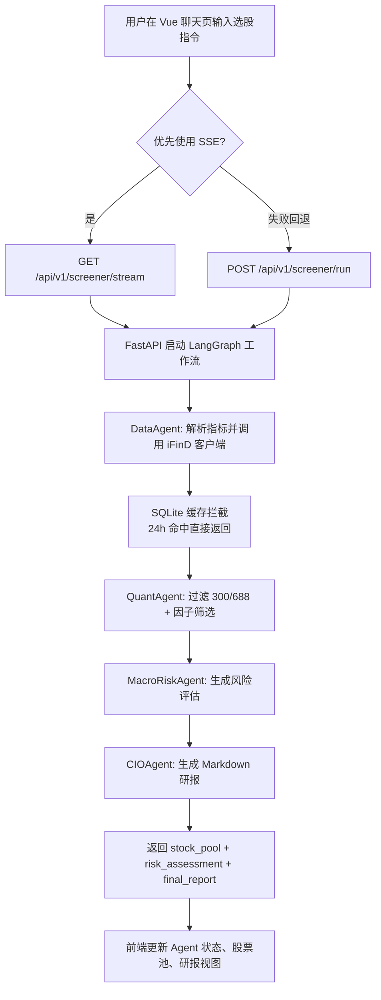

# AI Quant Screener

AI Quant Screener 是一个前后端一体的量化选股原型系统：
1. 前端使用 Vue 3 提供聊天式交互与结果可视化。
2. 后端使用 FastAPI + LangGraph 执行多智能体工作流。
3. 数据层使用 SQLite + SQLAlchemy 进行本地缓存与 Token 持久化。

## 核心能力
1. 自然语言输入选股指令。
2. 四智能体流水线执行：Data -> Quant -> MacroRisk -> CIO。
3. 支持实时流式状态（SSE）与非流式兜底接口。
4. 输出结构化股票池 + Markdown 研报。

## 系统流程图


## 技术栈
- 前端: Vue 3, Vue Router, Vite, Tailwind CSS v4
- 后端: FastAPI, SQLAlchemy, Pandas, LangChain, LangGraph
- 数据库: SQLite
- 模型接口: DeepSeek（可选，未配置时自动降级 mock）

## 目录结构
```text
.
├─ app/                    # Vue 前端
├─ backend/                # FastAPI 后端
│  ├─ main.py              # API 入口
│  ├─ database.py          # 数据库连接与会话
│  ├─ models.py            # ORM 模型
│  ├─ ifind_client.py      # iFinD 封装 + 缓存逻辑
│  └─ agent_workflow.py    # LangGraph 工作流
├─ styles/                 # 前端样式
├─ init_db.py              # 初始化数据库脚本
├─ requirements.txt        # Python 依赖
├─ package.json            # Node 依赖
└─ .env.example            # 环境变量模板
```

## 快速开始

### 1) 启动后端
```bash
python -m venv .venv
.venv\Scripts\activate
pip install -r requirements.txt
python init_db.py
uvicorn backend.main:app --reload --port 8006
```

### 2) 启动前端
```bash
npm install
npm run dev
```
默认前端地址：`http://127.0.0.1:5176`

## 环境变量
复制 `.env.example` 为 `.env` 后按需配置。

| 变量名 | 说明 | 是否必填 |
| --- | --- | --- |
| `IFIND_REFRESH_TOKEN` | iFinD 刷新令牌 | 生产建议必填 |
| `IFIND_ACCESS_TOKEN` | 初始 access token（可选） | 否 |
| `DEEPSEEK_API_KEY` | DeepSeek API Key | 建议填写 |
| `VITE_API_BASE_URL` | 前端后端基地址 | 默认 `http://127.0.0.1:8006` |

说明：未配置真实 Key 时，系统会自动返回可联调的 mock/fallback 数据。

## API 说明

| 方法 | 路径 | 用途 |
| --- | --- | --- |
| `POST` | `/api/v1/screener/run` | 非流式执行选股工作流 |
| `GET` | `/api/v1/screener/stream` | SSE 流式返回 Agent 状态与结果 |
| `GET` | `/api/v1/health` | 健康检查 |

### 请求示例
```bash
curl -X POST "http://127.0.0.1:8006/api/v1/screener/run" \
  -H "Content-Type: application/json" \
  -d "{\"query\":\"筛选低估值且净利润增长为正的主板股票\"}"
```

## 联调说明
1. 前端默认优先走 SSE 接口 `/api/v1/screener/stream`。
2. SSE 异常时自动回退到 `/api/v1/screener/run`。
3. 若后端地址不是本机 `8006` 端口，请在前端设置 `VITE_API_BASE_URL`。
4. 聊天页会实时展示各 Agent 状态，并在收到 `CIOAgent` 的 `think` 字段时显示推理过程面板。

## 测试

### 安装测试依赖
```bash
pip install -r requirements-dev.txt
```

### 运行后端单元测试 + Mock E2E
```bash
python -m pytest -q
```
或
```bash
npm run test:backend
```

### 运行真实 API 的 Live E2E（可选）
当你已配置真实 iFinD / DeepSeek 环境变量时：
```bash
RUN_LIVE_E2E=1 python -m pytest -q tests/test_api_live_e2e.py
```
Windows PowerShell：
```powershell
$env:RUN_LIVE_E2E = "1"
python -m pytest -q tests/test_api_live_e2e.py
```

## 开发建议
1. 优先保证 `init_db.py` 成功执行后再启动后端。
2. 本地数据库文件 `quant_system.db` 为运行时产物，不应提交。
3. 如需接入真实 iFinD 返回结构，建议先固定字段映射再扩展前端展示。
