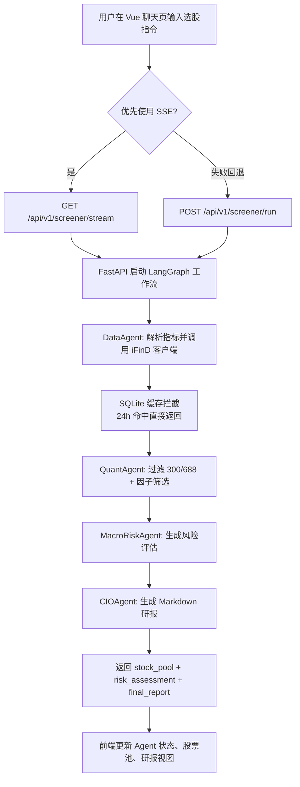

# AI Quant Screener

前端已迁移为 Vue，后端已按 `Plan.md` 完成 Phase 1-4 的基础实现：
- FastAPI 服务与路由
- SQLite + SQLAlchemy 本地缓存数据库
- iFinD Token 自动续期 + 数据请求封装 + 24 小时缓存拦截
- LangGraph 四智能体工作流（Data/Quant/MacroRisk/CIO）
- `/run` 与 `/stream`（SSE）接口

## 系统流程图


## 后端目录
```text
backend/
├─ __init__.py
├─ database.py
├─ models.py
├─ ifind_client.py
├─ agent_workflow.py
└─ main.py
init_db.py
requirements.txt
.env.example
```

## 阶段交付映射
1. Phase 1: `database.py` + `models.py` + `init_db.py`
2. Phase 2: `ifind_client.py`（TokenManager、fetch_basic_data、SQLite 缓存）
3. Phase 3: `agent_workflow.py`（LangGraph StateGraph + DeepSeek 节点）
4. Phase 4: `main.py`（`/api/v1/screener/run` + `/api/v1/screener/stream`）

## 后端快速启动
```bash
python -m venv .venv
.venv\Scripts\activate
pip install -r requirements.txt
python init_db.py
uvicorn backend.main:app --reload --port 8000
```

启动后将生成根目录数据库文件：`quant_system.db`。

## 环境变量
复制 `.env.example` 到 `.env` 后配置：
1. `IFIND_REFRESH_TOKEN`（必填，生产场景）
2. `DEEPSEEK_API_KEY`（建议填写）

未配置时系统会使用 mock/fallback 结果，便于本地联调。

## API 示例

### 1) 执行筛选流程
```bash
curl -X POST "http://127.0.0.1:8000/api/v1/screener/run" ^
  -H "Content-Type: application/json" ^
  -d "{\"query\":\"筛选低估值且净利润增长为正的主板股票\"}"
```

返回：
1. `stock_pool`: JSON 表格数据（来自 DataFrame）
2. `final_report`: Markdown 研报
3. `risk_assessment`: 风险评估摘要

### 2) SSE 流式状态
```bash
curl "http://127.0.0.1:8000/api/v1/screener/stream?query=筛选稳健高成长主板股票"
```

会持续收到：
1. 各 Agent 进度事件
2. 结果事件（表格 + Markdown）
3. `done` 结束事件

## 前端启动
```bash
npm install
npm run dev
```

## 前后端联调
前端默认请求 `http://127.0.0.1:8000`。如需切换地址，可在项目根目录创建 `.env.local`：

```bash
VITE_API_BASE_URL=http://127.0.0.1:8000
```

联调推荐顺序：
1. 启动后端：`uvicorn backend.main:app --reload --port 8000`
2. 启动前端：`npm run dev`
3. 在聊天页输入自然语言策略，前端会优先走 `/api/v1/screener/stream`（SSE），异常时自动回退 `/api/v1/screener/run`

## 说明
1. 当前 iFinD 响应解析做了兼容处理，若你提供精确字段规范，我可以再按真实返回结构做一版严格映射。
2. LangGraph 与 DeepSeek 已接入；无 Key 时会自动降级到可调试的 mock 输出。
